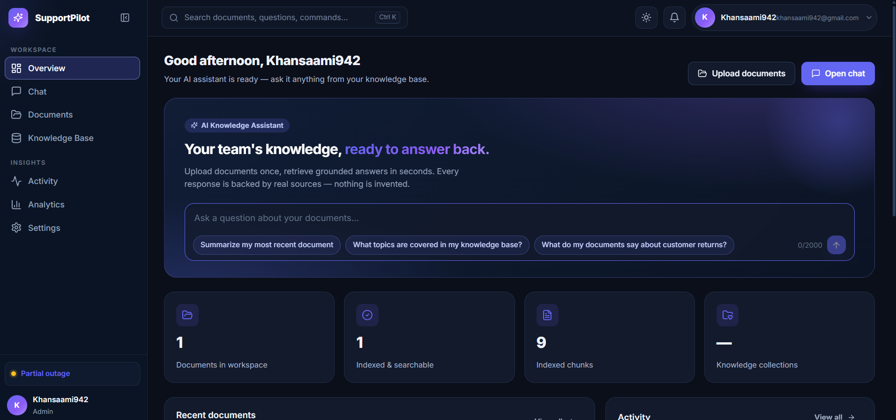

# SupportPilot — AI Customer Support Platform

A multi-tenant AI-powered customer support platform built with FastAPI.



## Features

- Upload documents and get AI-powered, grounded answers from your knowledge base
- Every response cites the exact document chunks it was built from
- Multi-tenant architecture with isolated data per workspace
- Real-time document indexing and semantic search

## Phase 1: Project Scaffolding

This phase establishes the project structure, dependencies, and local development environment.

### Prerequisites

- Python 3.10+
- Docker & Docker Compose
- Git

### Quick Start

1. **Create and activate virtual environment:**

```bash
   python -m venv venv
   ./venv/Scripts/Activate.ps1      # Windows PowerShell
   source venv/bin/activate          # macOS/Linux
```

2. **Install dependencies:**

```bash
   pip install -r requirements.txt
```

3. **Set up environment variables:**

```bash
   cp .env.example .env
   # Edit .env with your real values
```

4. **Start infrastructure services:**

```bash
   docker-compose up -d
```

5. **Run the application:**

```bash
   uvicorn app.main:app --reload --port 8000
```

6. **Run the frontend:**

```bash
   cd frontend
   npm install
   npm run dev
```

## Project Structure